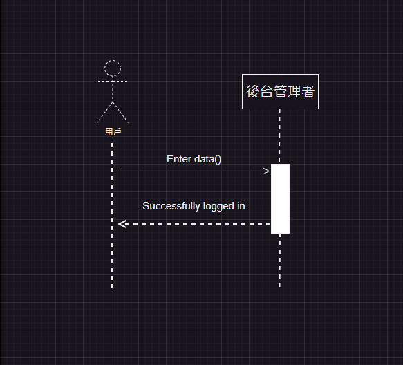
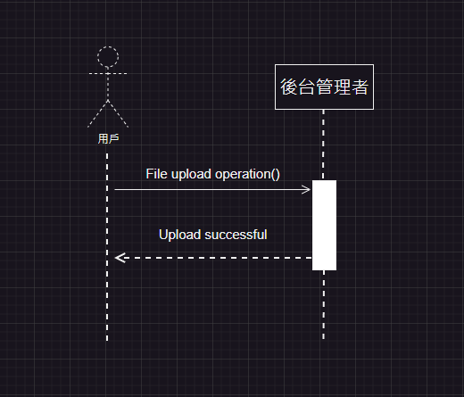
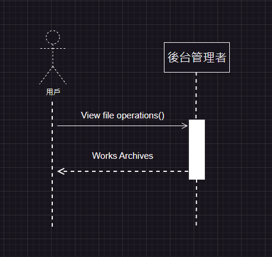
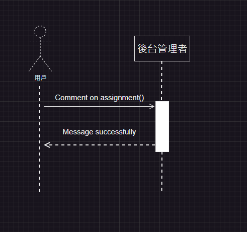
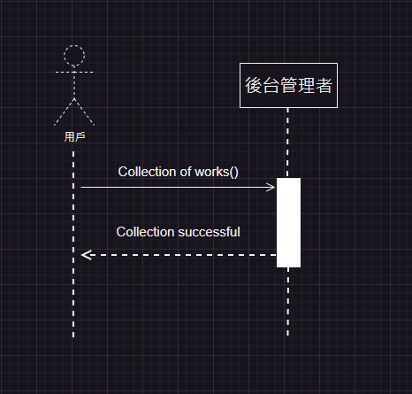
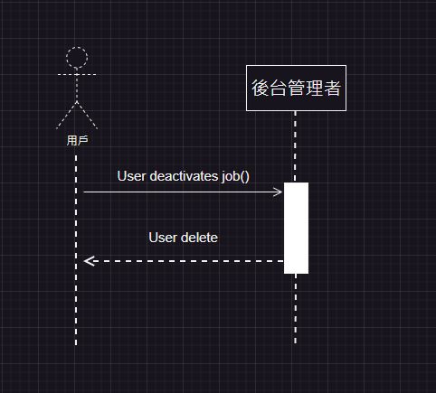
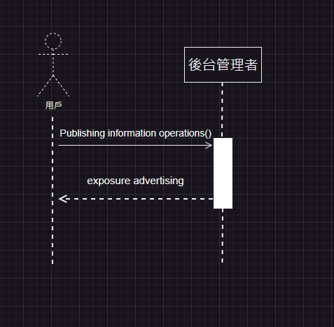
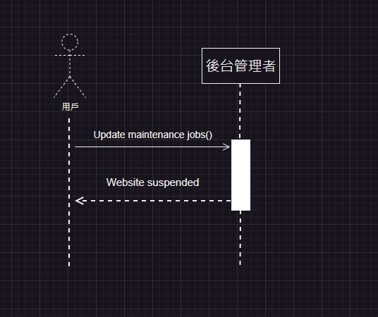

# pixiv 系統分析期末專案
>
>學號：111111104、111111114、111111115
> 
>姓名：翁永樺、葉鎧翔、楊佳源
> 
>撰寫時間：1200 (mins)

# 利害關係人與目標表

| 利害關係人        | 目標                                    |
|-------------------|-----------------------------------------|
| 插畫家            | 上傳和分享作品，獲得曝光和粉絲支持      |
| 用戶者            | 瀏覽、收藏和評論作品，支持喜愛的藝術家  |
| 平台管理者        | 維護網站運行，確保用戶遵守規則和政策    |
| 廣告商與贊助商    | 通過平台宣傳產品和服務，吸引潛在客戶    |

# 事件與使用案例表

| 事件                          | 使用案例                                              |
|-------------------------------|-------------------------------------------------------|
| 1.註冊會員登入                  | 輸入基本資料作業作業        |
| 2.插畫家上傳新作品              | 檔案上傳作業                |
| 3.讀者瀏覽作品                  | 檢視檔案作業                |
| 4.用戶評論                      | 留言發布作業                |
| 5.用戶收藏                      | 作品收藏作業                |
| 6.平台管理者處理舉報            | 用戶停用作業       |
| 7.廣告商發布廣告                | 發布資訊作業       |
| 8.平台進行系統更新和維護        | 系統更新和維護作業       |   

# 使用者案例圖

使用者案例圖

# 初步類別圖

初步類別圖
# 使用者案例
1.用戶

使用者名稱:用戶
使用者案例描述:在前台瀏覽作品並選擇是否申請會員
 
主要參予者:用戶、後台管理者
 
利害關係人與目標:用戶瀏覽、收藏和評論作品，支持喜愛的藝術家，插畫家傳和分享作品，獲得曝光和粉絲支持
 
前置條件:瀏覽作品並選擇申請會員
 
後置條件:收到用戶申請
 
主要成功情節:後台資訊是否核實並給予會員
 
例外情節:信箱有誤無法加入
 

2.插畫家

使用者名稱:插畫家
 
使用者案例描述:製作自己的作品並經過管理者檢查上傳至網站
 
主要參予者:插畫家、後臺管理者
 
利害關係人與目標:上傳和分享作品給用戶看，獲得曝光和粉絲支持
 
前置條件:製作作品並上傳
 
後置條件:管理者審核
 
主要成功情節:經過審核並成功上傳作品
 
例外情節:圖片有違規不予上傳
 

3.廣告與贊助商

使用者名稱:廣告與贊助商
 
使用者案例描述:贊助商看到喜歡的插畫家並給予金錢上的支持利用與商業目的
 
主要參予者:廣告與贊助商、插畫家
 
利害關係人與目標:廣告與贊助商花錢請插畫家推廣或創作作品
 
前置條件:觀看作品並且找到喜歡的插畫家給予金錢以及委託
 
後置條件:插畫家選擇接受委託以及金錢
 
主要成功情節:確認委託並且成功接受
 
例外情節:協調不易委託失敗
 

4.後台管理者

使用者名稱:後台管理者
 
使用者案例描述:審核插畫家圖片並且核對用戶申請會員資料
 
主要參予者:用戶、插畫家、後台管理者
 
利害關係人與目標:維護網站運行，確保用戶遵守規則和政策並通過申請以及上傳作品
 
前置條件:會員申請資料以及插畫家上傳作品
 
後置條件:審核資料以及作品是否屬實或違規
 
主要成功情節:成功成為會員、上傳作品
 
例外情節:資料有誤駁回、作品違規不予上傳
 

# 系統循序圖與合約
合約1:Enter data()
 
操作:Enter data()
 
交互參照:申請會員填寫資料
 
前置條件:用戶選擇申請
 
後置條件:登入會員
 

合約2:File upload operation()
 
操作:File upload operation()
 
交互參照:通過審核允許上傳
 
前置條件:選擇上傳檔案
 
後置條件:作品已上架展示
 

合約3:View file operations()
 
操作:View file operations()
 
交互參照:檢視插畫家的作品
 
前置條件:瀏覽並點選喜歡的作品
 
後置條件:放大觀看作品
 

合約4:Comment on assignment()
 
操作:Comment on assignment()
 
交互參照:瀏覽作品並評論
 
前置條件:已登入會員並觀看圖片在下方留言
 
後置條件:留言成功任何人都能讀取評論
 

合約5:Collection of works
 
操作:Collection of works
 
交互參照:收藏作品
 
前置條件:擁有會員身分點選收藏
 
後置條件:收藏進收藏資料夾
 

合約6:User deactivates job
 
操作:User deactivates job
 
交互參照:用戶觸犯不當行為
 
前置條件:會員身分違反規則
 
後置條件:會員身分刪除並給予通知
 

合約7:Publishing information operations
 
操作:Publishing information operations
 
交互參照:讓所有人都能看到廣告
 
前置條件:給予金錢並要求曝光廣告內容
 
後置條件:達成協議收取金錢並曝光廣告
 

合約8:Update maintenance jobs
 
操作:Update maintenance jobs
 
交互參照:平台進行系統更新和維護
 
前置條件:平台中有錯誤或新增
 
後置條件:暫時停止瀏覽平台
 

# Git Gragh 
